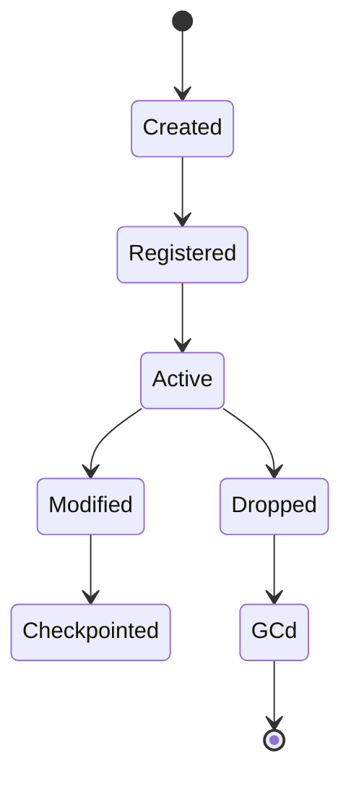

## States
- Created → Registered → Active → Modified → Checkpointed → Dropped → GC’d

## Transitions
- Create: <validation, catalog, WAL, page alloc, locks>
- Alter: <catalog change, data migration>
- Drop: <ref checks, WAL tombstone, reclaim/GC>
- Recovery: <redo/undo implications>

## Diagrams

## Observability

## Implementation References
- `ScratchBird/<path>:<start>-<end>` — <what>

## Spec Trace
- [REQ-...](../../traceability/spec/requirements.md#...)
