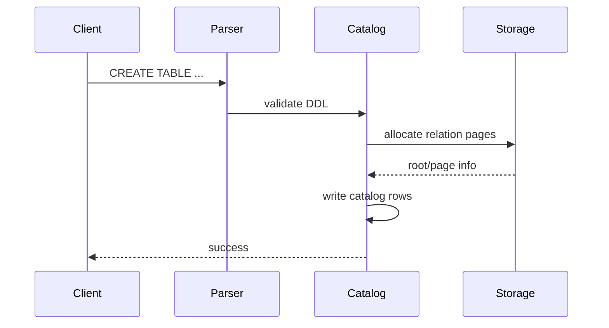

[ScratchBird Analysis Documentation](../../index.md)

### Catalog and bootstrap

System tables, UUIDs, bootstrap SQL, DDL transactional semantics, compatibility views.

## Sequence: CREATE TABLE

Source: `assets/diagrams/ddl_create_table.mmd`

## Implementation References
- `ScratchBird/include/scratchbird/engine/catalog_manager.h`
- `ScratchBird/src/engine/catalog_manager.cpp`
- `ScratchBird/src/engine/catalog_bootstrap.cpp`

## Spec Trace
- [REQ-CATALOG-BOOT-SDB-TABLES](../../traceability/spec/requirements.md#req-catalog-boot-sdb-tables)

## Related
- [ScratchBird Analysis Documentation](../../index.md)
