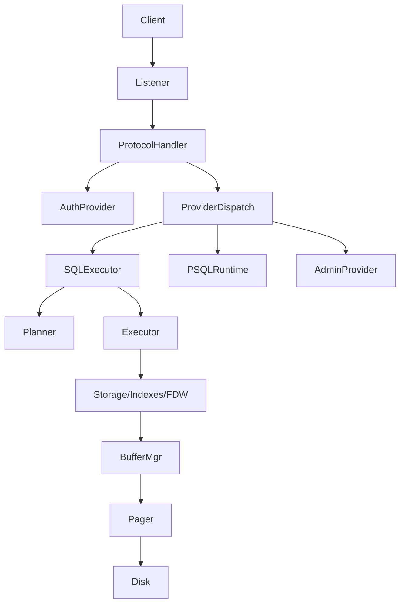

[ScratchBird Analysis Documentation](../../index.md)

### Server, protocol, and authentication

Network server, sessions, protocols, provider dispatch, auth providers, TLS, pooling, buffers.

## Component diagram: server/provider dispatch and executor pipeline

Source: `assets/diagrams/server_components.mmd`

## Implementation References
- `ScratchBird/include/scratchbird/engine/network_server.h`
- `ScratchBird/include/scratchbird/engine/protocol_handler.h`
- `ScratchBird/include/scratchbird/engine/firebird_protocol.h`
- `ScratchBird/include/scratchbird/engine/authentication.h`
- `ScratchBird/include/scratchbird/engine/tls_server.h`
- `ScratchBird/include/scratchbird/engine/connection_pool.h`
- `ScratchBird/src/engine/network_server.cpp`
- `ScratchBird/src/engine/protocol_handler.cpp`
- `ScratchBird/src/engine/firebird_protocol*.cpp`
- `ScratchBird/src/engine/authentication.cpp`
- `ScratchBird/src/engine/tls_server.cpp`
- `ScratchBird/src/engine/connection_pool.cpp`

## Spec Trace
- [REQ-SERVER-LISTENER](../../traceability/spec/requirements.md#req-server-listener)
- [REQ-AUTH-PASSWORD](../../traceability/spec/requirements.md#req-auth-password)

## Related
- [ScratchBird Analysis Documentation](../../index.md)
