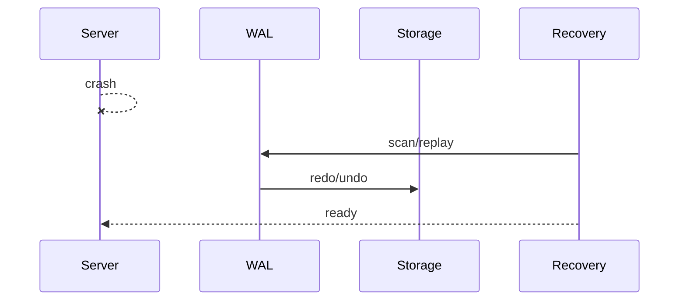

### Storage

Start here for on-disk structures, heap, space management, and buffer/pager.

- [Heap](heap.md): tuple and page format, visibility helpers, codecs
- [ODS](ods.md): on-disk structures and constants
- [Space/Allocator](space_allocator.md): PIP/TIP/SpaceCatalog and allocation
- [Heap lifecycle](lifecycle.md): create/open/insert/scan/truncate/drop

## Sequence: Crash → Recovery

Source: `assets/diagrams/crash_recovery.mmd`

## Implementation References
- `ScratchBird/include/scratchbird/engine/heap.h`
- `ScratchBird/include/scratchbird/engine/heap_rel.h`
- `ScratchBird/include/scratchbird/engine/ods.h`
- `ScratchBird/include/scratchbird/engine/alloc.h`
- `ScratchBird/src/engine/alloc.cpp`
- `ScratchBird/src/engine/ods.cpp`

## Spec Trace
- [REQ-CORE-HEAP-ODS](../../traceability/spec/requirements.md#req-core-heap-ods)
- [REQ-CORE-HEAP-TUPLE-FORMAT](../../traceability/spec/requirements.md#req-core-heap-tuple-format)
- [REQ-CORE-HEAP-API](../../traceability/spec/requirements.md#req-core-heap-api)
- [REQ-CORE-HEAP-SCAN](../../traceability/spec/requirements.md#req-core-heap-scan)
- [REQ-CORE-HEAP-VALIDATOR](../../traceability/spec/requirements.md#req-core-heap-validator)
- [REQ-CORE-SPACE-PIP](../../traceability/spec/requirements.md#req-core-space-pip)
- [REQ-CORE-SPACE-TIP-SEED](../../traceability/spec/requirements.md#req-core-space-tip-seed)
- [REQ-CORE-SPACE-CATALOG](../../traceability/spec/requirements.md#req-core-space-catalog)
- [REQ-CORE-SPACE-ALLOCATOR](../../traceability/spec/requirements.md#req-core-space-allocator)
- [REQ-CORE-SPACE-RECLAIM](../../traceability/spec/requirements.md#req-core-space-reclaim)
