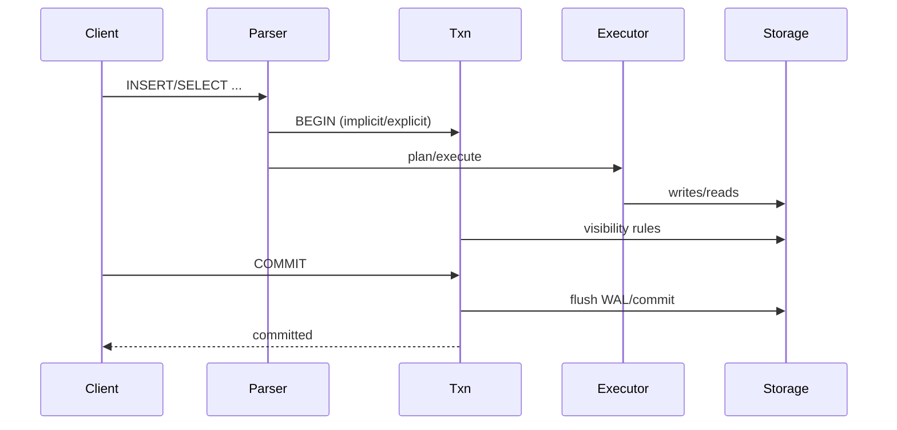

### Transactions and MGA

Visibility rules, TIP usage, isolation modes, and conflict detection.

## Sequence: INSERT/SELECT/COMMIT

Source: `assets/diagrams/insert_select_commit.mmd`

## Implementation References
- `ScratchBird/include/scratchbird/engine/txn.h`
- `ScratchBird/src/engine/txn.cpp`
- `ScratchBird/src/engine/serializable_isolation.cpp`

## Spec Trace
- [REQ-TXN-MGA-TIP](../../traceability/spec/requirements.md#req-txn-mga-tip)
- [REQ-TXN-MGA-VISIBILITY](../../traceability/spec/requirements.md#req-txn-mga-visibility)
