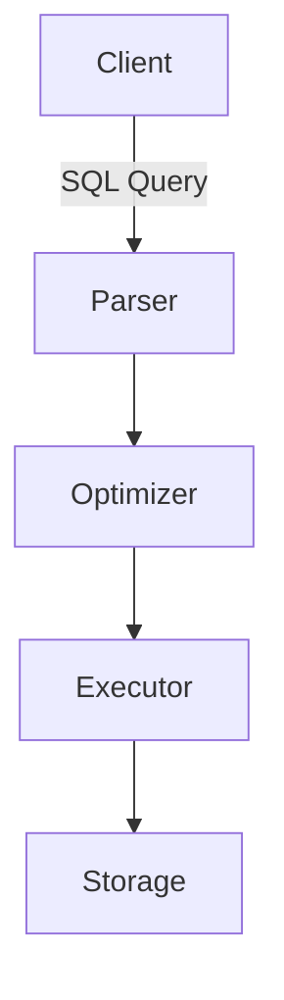
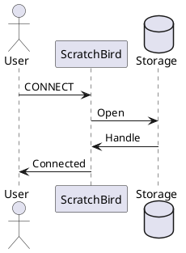

# Wiki Images Directory

**Purpose:** Image assets for ScratchBird wiki documentation
**Last Updated:** 2026-01-03

---

## Directory Structure

```
images/
├── README.md                  # This file
├── logos/                     # ScratchBird logos and branding ✅
├── architecture/              # Architecture and design diagrams
├── screenshots/               # Application and UI screenshots
└── diagrams/                  # General diagrams and illustrations
```

---

## Image Categories

### logos/
**Purpose:** Official ScratchBird logos and branding materials

**Contents:**
- TransparentScratchBirdLogoHeader.png (primary header logo)
- ScratchBirdLogo.png (icon/avatar)
- ScratchBirdLogoHeader.png (header with background)
- LogoWork.svg (vector source)

**Usage:** See [logos/README.md](logos/README.md) and [../LOGO_USAGE.md](../LOGO_USAGE.md)

### architecture/
**Purpose:** System architecture and design diagrams

**Examples:**
- Database architecture diagrams
- Component interaction diagrams
- Data flow diagrams
- Transaction flow diagrams
- Storage layer architecture
- Query processing pipeline

**Formats:** PNG, SVG (preferred for diagrams)
**Tools:** Mermaid, PlantUML, draw.io, Excalidraw

### screenshots/
**Purpose:** Application screenshots and UI captures

**Examples:**
- Database client screenshots (DBeaver, pgAdmin)
- SQL query examples
- Configuration screens
- Admin interfaces
- Error messages
- Installation wizards

**Format:** PNG
**Guidelines:**
- Crop to relevant area
- Use consistent window size
- Include captions
- Annotate with arrows/highlights if needed
- Optimize file size (< 500KB preferred)

### diagrams/
**Purpose:** General diagrams, flowcharts, and illustrations

**Examples:**
- Flowcharts
- Process diagrams
- Conceptual illustrations
- Entity-relationship diagrams (ERD)
- Sequence diagrams
- Decision trees

**Formats:** PNG, SVG
**Tools:** Mermaid (preferred), draw.io, PlantUML, Graphviz

---

## Image Guidelines

### File Naming

**Use descriptive names:**
```
✅ Good: architecture-transaction-flow.png
✅ Good: screenshot-dbeaver-connection.png
✅ Good: diagram-migration-workflow.png

❌ Bad: image1.png
❌ Bad: screenshot.png
❌ Bad: diagram.png
```

**Convention:**
- Use kebab-case (lowercase with hyphens)
- Include category prefix (architecture-, screenshot-, diagram-)
- Be specific about content
- Include version if relevant: diagram-v2-architecture.png

### File Formats

**PNG (Raster):**
- Screenshots
- Complex images with many colors
- Photos
- Keep under 500KB if possible

**SVG (Vector):**
- Diagrams and flowcharts
- Architecture diagrams
- Logos and icons
- Scalable graphics
- Preferred for technical diagrams

**JPEG:**
- Avoid unless absolutely necessary
- Use only for photos
- Not recommended for diagrams or screenshots

### Image Optimization

Before adding images:

```bash
# Optimize PNG files
optipng -o7 your-image.png
# or
pngcrush -brute input.png output.png

# Resize if too large
convert large-image.png -resize 1200x800 optimized-image.png

# For SVG, use SVGO
svgo input.svg -o output.svg
```

**Target sizes:**
- Diagrams: < 200KB
- Screenshots: < 500KB
- Architecture diagrams: < 300KB
- Complex images: < 1MB (maximum)

### Alt Text

Always include descriptive alt text:

```markdown

```

**Good alt text:**
- Describes what the image shows
- Helps screen readers
- Provides context
- 10-50 words

**Bad alt text:**
- "Image"
- "Diagram"
- Empty alt text

---

## Creating Diagrams

### Mermaid (Recommended)

Mermaid diagrams can be embedded directly in markdown:

```markdown

```

**Or** export as PNG/SVG and add to images/diagrams/

### PlantUML

For complex UML diagrams:



Export and save in `images/diagrams/`

### draw.io

1. Create diagram at https://app.diagrams.net/
2. Export as PNG or SVG
3. Save in appropriate directory
4. Keep source .drawio file in `wiki/assets/` for editing

---

## Adding Images to Wiki Pages

### Basic Syntax

```markdown

```

### With Caption

```markdown


*Figure 1: Multi-generational transaction flow in ScratchBird*
```

### Resized Image

```markdown

```

### Centered Image

```html
<p align="center">
  
</p>
```

---

## Image Inventory

Track images as they're added:

| Category | Count | Total Size | Notes |
|----------|-------|------------|-------|
| logos | 4 | ~1.6 MB | Complete |
| architecture | 0 | 0 | Pending |
| screenshots | 0 | 0 | Pending |
| diagrams | 0 | 0 | Pending |

---

## Needed Images (Priority)

### High Priority
- [ ] Architecture: Overall system architecture
- [ ] Architecture: MGA transaction flow
- [ ] Screenshot: Docker installation steps
- [ ] Screenshot: First connection in DBeaver
- [ ] Diagram: Migration workflow (Firebird → ScratchBird)

### Medium Priority
- [ ] Architecture: Storage layer design
- [ ] Architecture: Query processing pipeline
- [ ] Screenshot: Python driver connection
- [ ] Diagram: Index types comparison
- [ ] Diagram: Replication architecture

### Low Priority
- [ ] Screenshots: All driver connections
- [ ] Diagrams: Feature comparisons
- [ ] Architecture: Clustering (future)

---

## Contributing Images

1. **Create/capture image** following guidelines above
2. **Optimize file size** (compress, resize)
3. **Name descriptively** using conventions
4. **Place in correct directory**
5. **Update this README** inventory section
6. **Reference in documentation** with good alt text
7. **Test display** in wiki preview
8. **Commit and sync** to wiki

---

## Tools and Resources

### Diagram Tools
- **Mermaid** - https://mermaid.js.org/ (embedded in markdown)
- **PlantUML** - https://plantuml.com/
- **draw.io** - https://app.diagrams.net/
- **Excalidraw** - https://excalidraw.com/ (hand-drawn style)

### Screenshot Tools
- **Linux:** Flameshot, Spectacle, GNOME Screenshot
- **macOS:** Cmd+Shift+4, Skitch
- **Windows:** Snipping Tool, Greenshot

### Image Optimization
- **optipng** - PNG optimization
- **pngcrush** - PNG compression
- **ImageMagick** - Resize and convert
- **SVGO** - SVG optimization

---

**Maintained by:** Documentation Team
**Questions:** #documentation on Discord
