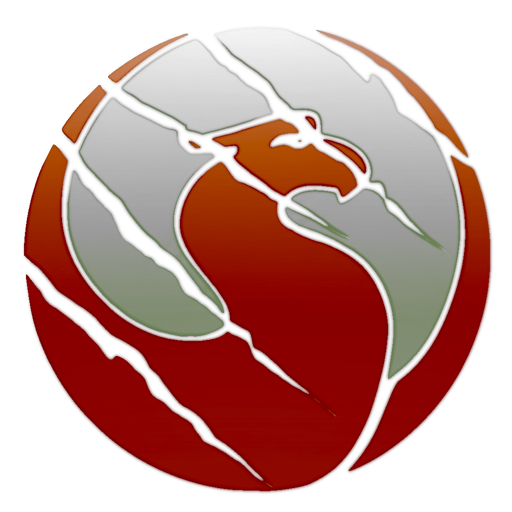

# ScratchBird Logos and Branding

**Source:** `/docs/Artwork/`
**Last Updated:** 2026-01-30

---

## Logo Files

### TransparentScratchBirdLogoHeader.png
- **Size:** 43 KB
- **Dimensions:** Header/banner size
- **Background:** Transparent
- **Usage:**
  - Wiki header (Home page)
  - Documentation headers
  - GitHub README header
  - Presentations and slides

### ScratchBirdLogo.png
- **Size:** 507 KB
- **Background:** With background
- **Usage:**
  - Project icon/avatar
  - Social media profile
  - Favicon source
  - Application icons
  - Large format printing

### ScratchBirdLogoHeader.png
- **Size:** 49 KB
- **Background:** With background
- **Usage:**
  - Alternative header
  - Email signatures
  - Documents with colored backgrounds

### LogoWork.svg
- **Size:** 965 KB
- **Format:** SVG (vector)
- **Usage:**
  - Source file for modifications
  - Scalable graphics
  - Print materials
  - High-resolution needs

---

## Usage Guidelines

### In Wiki Pages

**Header Image (recommended):**
```markdown

```

**Inline Logo:**
```markdown

```

**Small Icon:**
```markdown
{ width=64px }
```

### In Markdown Files

For repository markdown files (README.md, etc.):
```markdown

```

### In HTML

For HTML documentation:
```html

```

---

## Logo Specifications

### Colors

Based on the logo artwork:
- Primary color: [Extract from logo]
- Secondary color: [Extract from logo]
- Text color: [Extract from logo]

### Sizing Recommendations

**Wiki Header:**
- Max width: 800px
- Height: Auto
- Format: PNG with transparency

**Social Media:**
- Twitter/X: 400x400px (square crop of ScratchBirdLogo.png)
- LinkedIn: 300x300px
- GitHub: 200x200px

**Favicon:**
- Size: 32x32px, 64x64px, 128x128px
- Source: ScratchBirdLogo.png (cropped and scaled)
- Format: ICO or PNG

---

## Copyright and Licensing

**Copyright:** ScratchBird Project
**License:** [LICENSE_TYPE]

**Usage Terms:**
- Free to use for ScratchBird project documentation
- Free to use in applications using ScratchBird
- Attribution appreciated but not required
- Do not use to imply endorsement without permission
- Do not modify without permission

---

## Creating Additional Sizes

### Generate Favicon

```bash
# Using ImageMagick
convert ScratchBirdLogo.png -resize 32x32 favicon-32.png
convert ScratchBirdLogo.png -resize 64x64 favicon-64.png
convert ScratchBirdLogo.png -resize 128x128 favicon-128.png

# Create ICO file (Windows)
convert favicon-32.png favicon-64.png favicon-128.png favicon.ico
```

### Generate Social Media Icons

```bash
# Square 400x400 for Twitter/X
convert ScratchBirdLogo.png -resize 400x400 -gravity center -extent 400x400 twitter-icon.png

# Square 300x300 for LinkedIn
convert ScratchBirdLogo.png -resize 300x300 -gravity center -extent 300x300 linkedin-icon.png
```

### Optimize PNG Files

```bash
# Using optipng
optipng -o7 *.png

# Using pngcrush
pngcrush -brute input.png output.png
```

---

## File Inventory

| File | Size | Format | Transparency | Purpose |
|------|------|--------|--------------|---------|
| TransparentScratchBirdLogoHeader.png | 43 KB | PNG | Yes | Wiki/docs header |
| ScratchBirdLogo.png | 507 KB | PNG | No | Icon/avatar |
| ScratchBirdLogoHeader.png | 49 KB | PNG | No | Alt header |
| LogoWork.svg | 965 KB | SVG | N/A | Source vector |

---

## Related Artwork

Additional artwork files in `/docs/Artwork/`:
- `ScratchRobin.png` - Alternative mascot/branding
- `ScratchRobinLogoHeader.png` - Alternative header

---

**Maintained by:** Design Team
**Questions:** Contact design@scratchbird.dev
